# Intro to Gnuplot

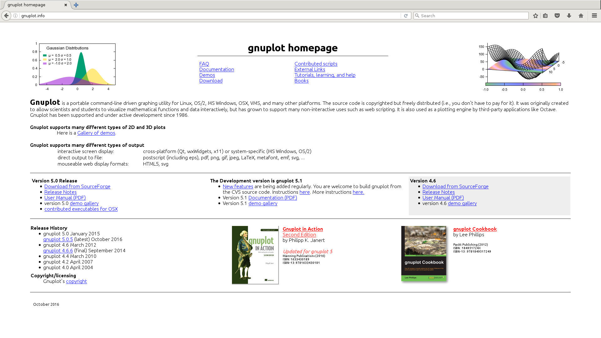
From the homepage, `Gnuplot` is a
> portable command-line driven graphing utility for Linux, OS/2, MS Windows, 
> OSX, VMS, and many other platforms.


* Download (http://gnuplot.info/download.html)
* Install
* Start!


This is how `Gnuplot` start screen looks on my machine:
```c
tom@wheelhorse:~$ gnuplot

	G N U P L O T
	Version 4.6 patchlevel 6    last modified September 2014
	Build System: Linux x86_64

	Copyright (C) 1986-1993, 1998, 2004, 2007-2014
	Thomas Williams, Colin Kelley and many others

	gnuplot home:     http://www.gnuplot.info
	faq, bugs, etc:   type "help FAQ"
	immediate help:   type "help"  (plot window: hit 'h')

Terminal type set to 'x11'
gnuplot> 
```

It's just like `Python` shell: type in your command, press `ENTER`, and
your command gets executed!

First of all, here are some useful commands:
* `exit` or `quit` to exit the application;
* `save <filename>` to save all your current setup to file;
* `load <filename>` -- the inverse -- to load settings/commands from file;
* `help <topic>` to get help!


### Simple plotting
From `help plot`:
> `plot` is the primary command for drawing plots with `gnuplot`.  It creates
> plots of  functions and data in many, many ways.  `plot` is used to draw 2D
> functions and data;

#### Syntax
```c
plot  [<ranges>]
      [<iteration>]
      <function> | <datafile> [datafile-modifiers]
      [axes <axes>] [<title-spec>] [with <style>]
      [, ...]
```

-------------------------------------------------------------------------------

```python
gnuplot> plot sin(x)
```
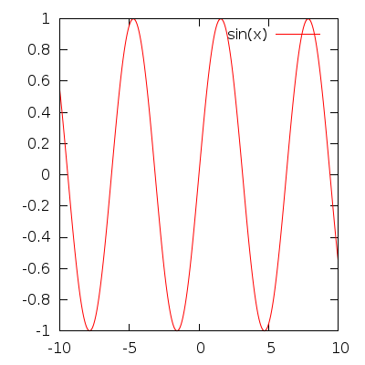


##### Ranges
From `help ranges`:
> The optional axis ranges at the start of a plot command specify the region of
> the graph that will be displayed.  These override any ranges established by a
> previous `set range` statement.

```python
gnuplot> plot[0:2] sin(x)
```
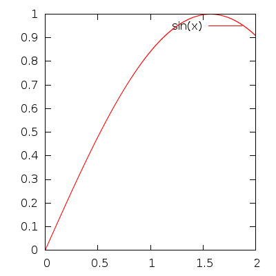

-------------------------------------------------------------------------------

```python
gnuplot> plot[0:2][-2:3] sin(x)
```
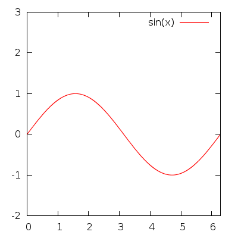

-------------------------------------------------------------------------------

```python
gnuplot> plot[0:] sin(x)
```
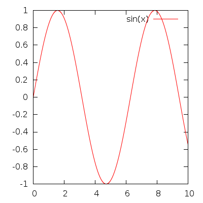


##### Function
From `help function`:
> Built-in or user-defined functions can be displayed by the `plot` and `splot`
> commands in addition to, or instead of, data read from a file. 

```python
gnuplot> plot[0:4] cos(2 * x) * cos(50 * x) * exp(-x), exp(-x), -exp(-x)
```
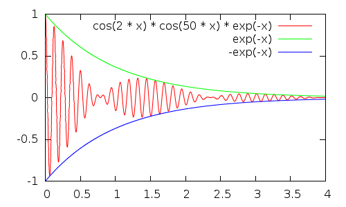

-------------------------------------------------------------------------------

```python
gnuplot> foo(x) = (x - 2) * (x - 1) * x * (x + 1) * (x + 2)
gnuplot> bar(x) = 1 / (x + 0.5) - 1
gnuplot> plot[-3:3][-3:3] foo(x), bar(x)
```
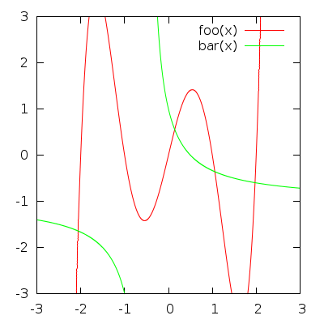


List of all `Gnuplot` built-in functions: 
http://gnuplot.sourceforge.net/docs_4.2/node53.html


##### Title
From `help plot title`:
> By default each plot is listed in the key by the corresponding function or 
> file name. You can give an explicit plot title instead using the `title` 
> option.

```python
gnuplot> plot[0:pi][-1:2] sin(x) title "Hello world!", \
                          2 * x title "", \
                          1 / sqrt(x) notitle
```
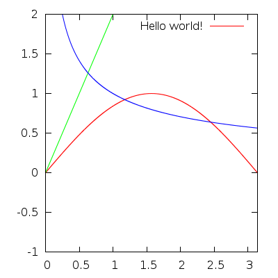

Notice the `pi` in xrange -- `Gnuplot` has it predefined.
```python
gnuplot> print pi
3.14159265358979
```
To see all defined variables use `show variables all`; `show variables pi` 
prints variables starting with `pi`.

Sometimes it is desired to change the key position. This can be done with the
`set key` command. For example,  `set key left center` places the  key on the
left horizontally and in the center vertically; `set key center bottom` --
in the center horizontally and at the bottom vertically. The default is
`set key right top`. For more, see `help set key`.

```python
gnuplot> set key right bottom
gnuplot> plot x + sin(x) title "set key right bottom"
```
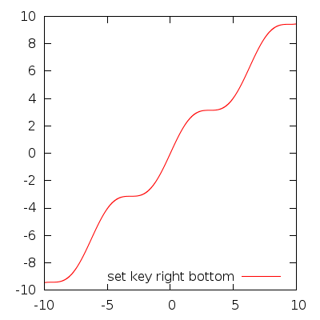


From `help plot title`:
> There is also an option that will interpret the first entry in a column of
> input data (i.e. the column header) as a text field, and use it as the key
> title.  See `datastrings`.


##### Data files
From `help datafile`:
> Discrete data contained in a file can be displayed by specifying the name of
> the data file (enclosed in single or double quotes) on the `plot` command line.

`Gnuplot` supports both text and binary files. Text files must consist of one or
more columns separated by `TAB`s. Just like in `Python` a hashtag `#` starts a
comment. It is common practice to give files of such format the `.dat` extension.

```python
# datafile.dat
#
###############################################
# DO use comments! Otherwise you end up       #
# having multitude of files containing 'some' #
# useful data and no way of figuring out what #
# this data means.                            #
###############################################
#
# X	2**(-X)

0	1
1	0.5
2	0.25
3	0.125
4	0.0625
5	0.03125
6	0.015625
7	0.0078125
8	0.00390625
9	0.001953125
```

```python
! python3 -c \
'for x in range(10): \
    print("{}\t{}".format(x, 2**-x)) \
' > datafile.dat
set grid
plot[-1:10][-0.2:1.2] "datafile.dat" title "Calculated 2^-^x"
```
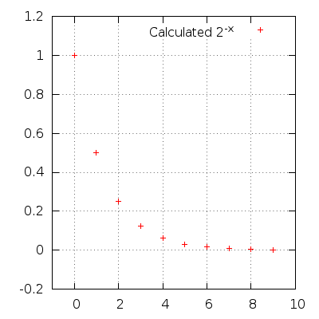

-------------------------------------------------------------------------------

```python
! python3 -c \
'for x in range(1,10): \
    print("{:.2e}\t{:.2e}\t{:.2e}" .format(x, 2**-x, 1./x)) \
' > datafile.dat
set grid
plot[-1:10][-0.2:1.2] "datafile.dat" using 1:2 title "2^-^x", \
                      "" u 1:3 title "1/x", \
                      "" u 1:(1. / ($1 - 2)) tit "1/(x-2)"
```
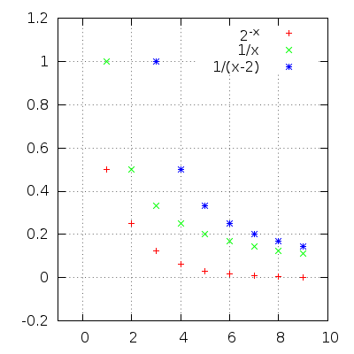

Use `<N1>:<N2>` to specify columns you want to plot. Here `<N1>` is the "x-column"
and `<N2>` is the "y-column". You can also perform mathematical operations on
columns -- use `$<N>` to get the numerical value of column `N`.

Column `0` gives you the number of the point.
```python
set key right bottom
plot "datafile.dat" using 0:($0 + 1) title "x"
```
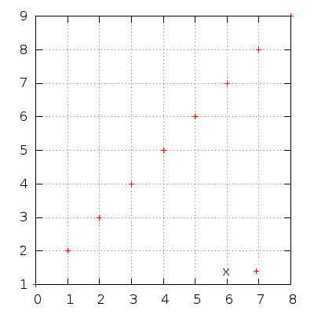


##### Style
```python
! python3 -c \
'from math import *; \
 list(map(lambda x: print("{}\t{}".format(x, sin(0.5 * x))), range(20))) \
' > datafile.dat
set grid
plot[-1:20][-8:8] "datafile.dat" with boxes title "boxes", \
                  "" u 1:(-$2) with impulses title "impulses", \
                  "" u 1:($2 - 2) with lines title "lines", \
                  "" u 1:($2 - 4) with linespoints title "linespoints", \
                  "" u 1:($2 - 6) with points title "boxes"
```
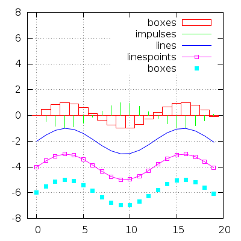

-------------------------------------------------------------------------------

To test which "style"s are available, type `test`:
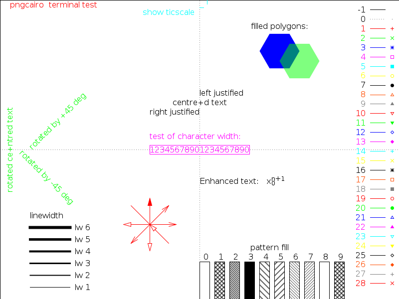

-------------------------------------------------------------------------------


Let's emulate a real world example. Suppose, we are measuring position of a 
particle as a function of time. We thus have three columns in our file:
* time point `t` in seconds, 
* `X`-coordinate in cm, and
* error in `X`.
```python
! python3 -c \
'import numpy as np; \
 \
 mu, sigma = 0, 4; \
 N = 20; \
 errs = np.random.normal(mu, sigma, N); \
 t = np.linspace(10, 30, N); \
 x = 3 * t + 4 + errs; \
 data = np.dstack((t,x,errs))[0]; \
 np.savetxt("datafile.dat", data, delimiter="\t") \
'
set grid
set key right bottom
# p  ---> points
# lt ---> linetype
# lc ---> linecolor
# ps ---> pointsize
set xlabel "Time, t [s]"
set ylabel "Particle position, X [cm]"
plot[8:32] "datafile.dat" with p lt 7 ps 1 lc rgb "forest-green" \
                          title "Measured data"
```
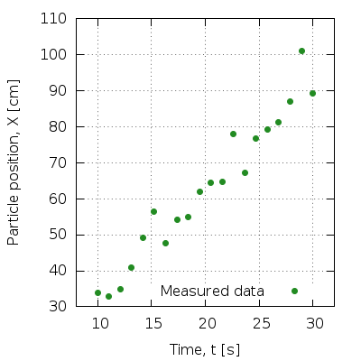


But we need errorbars!

From `help errorbars`:
> Error bars are supported for 2D data file plots by reading one to four
> additional columns (or `using` entries); these additional values are used in
> different ways by the various errorbar styles.

Possible data layouts:
```
	(x, y, ydelta)
	(x, y, ylow, yhigh)
	(x, y, xdelta)
	(x, y, xlow, xhigh)
	(x, y, xdelta, ydelta)
	(x, y, xlow, xhigh, ylow, yhigh)
```

```python
plot[8:32] "datafile.dat" u 1:2:3 w yerrorbars \
                          lt 7 ps 1 lc rgb "forest-green" \
                          title "Measured data"
```
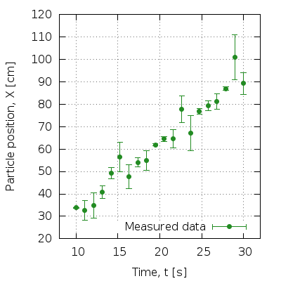


### The useful stuff

We didn't do the measurements for nothing, right? Let's determine particle's speed! 
Guess: `position(t) = V * t + X0`. We want to find `V`. This is called a `fit`.
```python
position(x) = V * x + X0
set fit quiet
set fit errorvariables
fit position(x) "datafile.dat" u 1:2:3 via V, X0
plot[8:32] "datafile.dat" u 1:2:3 w yerrorbars \
                          lt 7 ps 1 lc rgb "forest-green" \
                          title "Measured data", \
           position(x) lt 1 lw 2 lc rgb "dark-blue" \
                       title "Approximation"
print "V = ", V, " +/- ", V_err
```
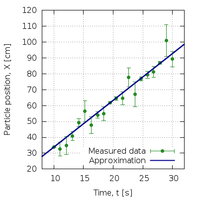

Sample output: `V = 2.96750427263468 +/- 0.051196205997724`. The actual value
of `V` is `3.0`.

-------------------------------------------------------------------------------

We all learned about the "Gaussian" distribution etc. Can we visualize it?
First of all, we need more points.
```python
! python3 -c \
'import numpy as np; \
 \
 mu, sigma = 0, 4; \
 N = 400; \
 errs = np.random.normal(mu, sigma, N); \
 t = np.linspace(10, 30, N); \
 x = 3 * t + 4 + errs; \
 data = np.dstack((t,x,errs))[0]; \
 np.savetxt("datafile.dat", data, delimiter="\t") \
'
position(x) = V * x + X0
set fit quiet
set fit errorvariables
fit position(x) "datafile.dat" u 1:2:3 via V, X0
plot[8:32] "datafile.dat" u 1:2 w p \
                          lt 7 ps 0.4 lc rgb "forest-green" \
                          title "Measured data", \
           position(x) lt 1 lw 2 lc rgb "dark-blue" \
                       title "Approximation"
```
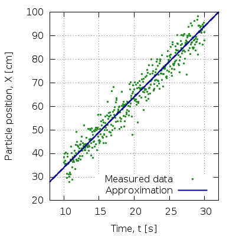

Let's now determine the deviations from the theoretical values.
```python
set xlabel "Time, t [s]"
set ylabel "Deviation, dX [cm]"
plot[8:32][-15:15] "datafile.dat" u 1:($2 - position($1)) w impulses \
                                  lt 7 lw 0.4 lc rgb "forest-green" \
                                  title "Deviation from theory"
```
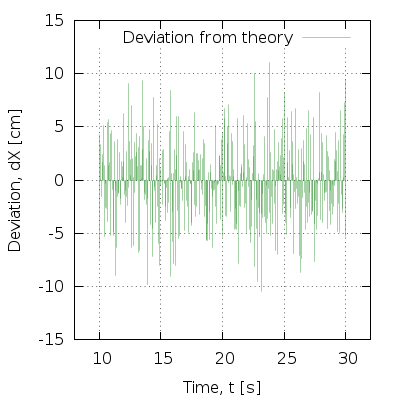

I wouldn't call this "clear". A histogram?
```python
# This genius way of making histograms in Gnuplot is
# taken from http://stackoverflow.com/a/2538846.
#
set xlabel "Deviation, dX [cm]"
set ylabel "Number of points, N [1]"
set style fill transparent solid 0.5 border rgb "black" # We want our boxes in the
                                                        # histogram filled. Here,
                                                        # we make them 50% transparent
                                                        # with solid black border.
                                                        # See `help set style fill`.
bin(x, width) = width * floor(x / width) # Rounds `x` down to the nearest
                                         # multiple of `width`.
stats "datafile.dat" u 2 name "S" nooutput # Get some statistics about the second
                                           # column (i.e. x) of our data
binwidth = 5 * (S_max - S_min) / S_records # Define a bin width base on statistics

# Magic...
plot[-15:15] "datafile.dat" u (bin(deviation($1,$2), binwidth)):(1.0) \
                              smooth frequency w boxes \
                              lt 1 lc rgb "forest-green" \
                              notitle
```
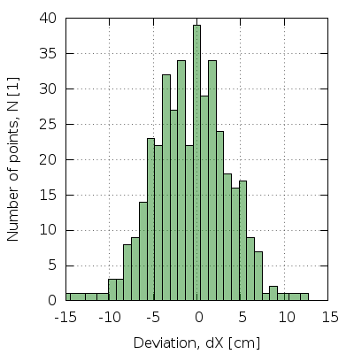

From `help smooth frequency`:
> The `frequency` option makes the data monotonic in x; points with the same
> x-value are replaced by a single point having the summed y-values.  The
> resulting points are then connected by straight line segments.

So we did the following:
* Make points that fall into the same "bin" have the same values. `bin()`
  does that.
* Make all points have the same y-value -- `1.0`.
* When `frequency` options sums y-value, the result turns out to be the
  number of points inside a bin.

```python
gauss(x) = A * exp(- (x - mu)**2 / (2 * sigma**2))
A = 50.0
mu = 0.1
sigma = 5.0
set table ".temp.dat"
plot "datafile.dat" u (bin(deviation($1,$2), binwidth)):(1.0) \
                      smooth frequency
unset table
fit gauss(x) ".temp.dat" via A, sigma, mu
! rm .temp.dat
plot[-15:15][0:50] "datafile.dat" u (bin(deviation($1,$2), binwidth)):(1.0) \
                                  smooth frequency w boxes \
                                  lt 1 lc rgb "forest-green" \
                                  title "Measured distribution", \
                   gauss(x) lt 1 lw 2 lc rgb "dark-blue" \
                            title "Gaussian distribution"
print "A = ", A, " +/- ", A_err
print "mu = ", mu, " +/- ", mu_err
print "sigma = ", sigma, " +/- ", sigma_err
```
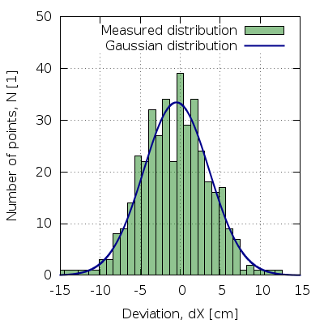
